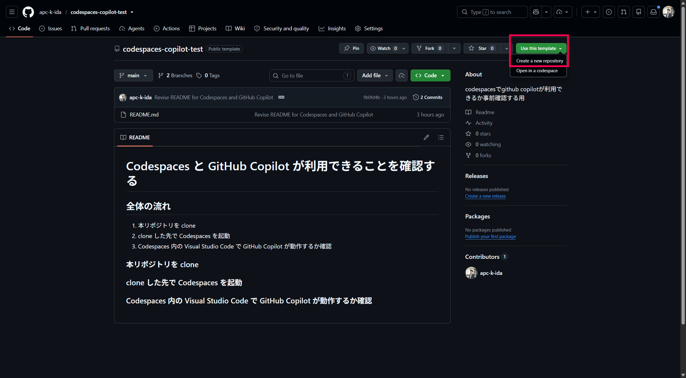
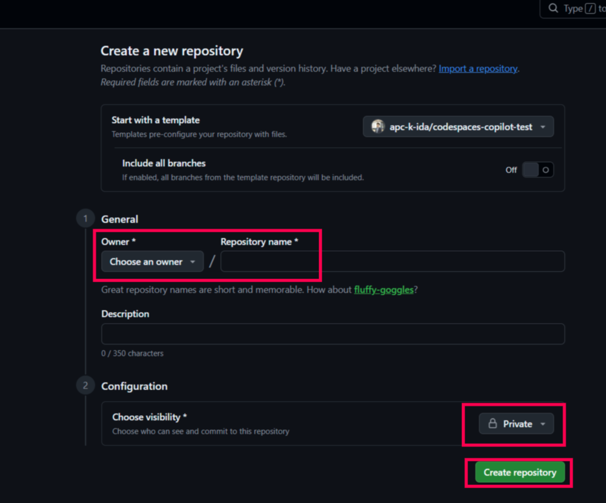
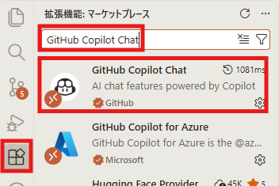
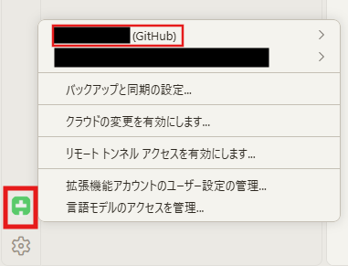
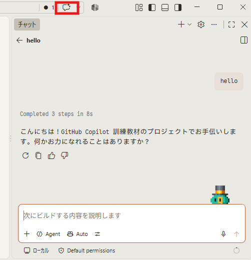
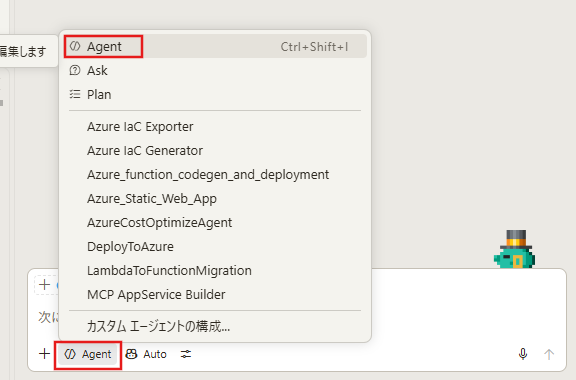

# ローカル環境で GitHub Copilot を利用できることを確認する

このリポジトリは、ローカル環境でハンズオンを受講する前に、Visual Studio Code と GitHub Copilot を利用できることを確認するためのものです。

## 事前に必要なもの

- GitHub Copilot を利用できる GitHub アカウント
- Visual Studio Code (バージョン 1.107 以降)
- Git ※リポジトリをローカル環境に clone する場合にのみ必要
- インターネット接続

## 全体の流れ

1. 本リポジトリをローカル環境に用意する
2. Visual Studio Code で本リポジトリを開く
3. GitHub にサインインする
4. GitHub Copilot Chat 拡張機能を確認する
5. Copilot Chat と Agent モードの動作を確認する
6. Python と pip を準備する

## 1. 本リポジトリをローカル環境に用意する

次のいずれかの方法で、本リポジトリをローカル環境に用意してください。

a. 研修案内で配布された ZIP ファイルを展開する

b. 研修案内で指定された本リポジトリをご自身の GitHub アカウントへ複製し、ローカル環境へ clone する

   1. **「Use this template」** の **「Create a new repository」** を選択してください。

      

   2. Owner をご自身のアカウント、任意のリポジトリ名を入力し、リポジトリの可視性は Private を選択してください。
   3. 最後に **「Create repository」** でリポジトリを複製します。

      

   4. 複製したリポジトリを clone してください。

   ```bash
   git clone <複製したリポジトリのURL>
   ```

## 2. Visual Studio Code でローカル環境のリポジトリを開く

Visual Studio Code を起動し、ローカル環境に用意したリポジトリのフォルダーを開いてください。

`.vscode/extensions.json` に拡張機能の推奨設定があります。拡張機能の推奨通知が表示された場合は、GitHub Copilot Chatをインストールしてください。

GitHub Copilot Chatをインストールしていないのに通知が表示されない場合は、拡張機能ビューで「GitHub Copilot Chat」を検索してインストールしてください。



## 3. GitHub にサインインする

Visual Studio Code 上部のサインインボタンからGitHubにサインインしてください。ブラウザが開いた場合は、GitHubアカウントで認証を完了します。
画面左下のアカウントアイコンをクリックし、GitHub アカウントが表示されていればサインインは完了です。



## 4. GitHub Copilot の動作を確認する

Visual Studio Code でCopilot Chatを開き、次のようなメッセージを送信してください。

```text
hello
```

Copilotから応答が返れば、Copilot Chatは利用可能です。



## 5. Agent モードの利用を確認する

Copilot Chat のモード選択でAgentモードを選択できることを確認してください。ハンズオンでは、特に指定がない限りAgentモードを利用します。



## 6. Python と pip を準備

1. 使用しているOSに応じて Python と pip をインストールしてください。

   | OS | インストールコマンド |
   | --- | --- |
   | Windows (PowerShell) | `winget install -e --id Python.Python.3.14` |
   | macOS (Homebrew) | `brew install python` |
   | Linux（Ubuntu / Debian） | `sudo apt update`<br>`sudo apt install -y python3 python3-pip` |

   - その他の Linux は各ディストリビューションのパッケージマネージャーで Python 3・pip・venv を導入してください。

2. インストール後、次のコマンドでPythonが3以降であり、pipが利用できることを確認してください。

   ```bash
   # Windows
   python --version
   python -m pip --version

   # macOS / Linux
   python3 --version
   python3 -m pip --version
   ```

   - Windowsで`python --version`の出力が`Python`だけになる場合は、実際のPythonではなくMicrosoft Storeの実行エイアスが起動しています。PowerShellをいったん閉じて開き直した後、バージョン番号が表示されることを確認してくだい。
